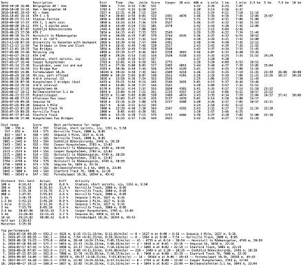

# Strava Stats

A tool that calculates and displays a large amount of statistics for your Strava activities.

<div align="middle">

&nbsp;

</div>
<br/>

The central idea behind this program is that it scans through all activities using
sliding windows of various distances and times, and finds the _best effort_ for each
distance and time span. I.e. the fastest consecutive 1 km, 5 km, 10 minutes, etc, you've
ever run or biked.

Moreover, it compares each best effort to the corresponding world record pace, to
calculate a _performance score_ from 0 to ~1000 (where 1000 equals world record pace,
500 equals 50 % of world record pace, etc). To do this, a formula has been developed
to estimate the world record running time _t_ (seconds) given any distance *d* (meters),
which for men's outdoor records looks like this:

<div align="middle">

</div>
<br/>

This formula is typically within 2 % of the actual world record time, for distances
ranging from 100 m (with running start) to beyond marathon.

By analyzing every possible distance (meter by meter, starting at 100 m),
a single performance score is calculated
for each activity, by choosing the distance that maximizes the score. For example:
a 2 km run would be given score 593 if, somewhere within those 2 km,
1626 consecutive meters were run at 6:16 minutes, which is 59.3 % of the
estimated world record pace, and no other
distance during that run had a higher score.

Analyzing a range of activities, a list of overall best performances are calculated,
i.e distances (one per activity) that one has performed best at (as compared to the world record),
and charts are produced that graph the performance score over distance. Estimated
personal bests are also displayed at various distances (assuming a best performance at each
distance).

For running activities, a few other statistics are also calculated:
[VO2 max](https://en.wikipedia.org/wiki/VO2_max),
[vVO2max](https://en.wikipedia.org/wiki/VVO2max),
and [Cooper distance](https://en.wikipedia.org/wiki/Cooper_test).

To speed up the runtime and reduce the number of calls to the Strava API,
activities are cached on disk, so that only new and missing ones
are downloaded when the program is run.

### Starting

Copy the file `athlete.properties.example` to `athlete.properties` and edit it to add your
Strava API access token. Optional additional configuration (e.g. whether to analyze
bike rides instead of runs) can be done in `Config.java`. To run the program, type:
```
gradle run
```

(Requires Java 11.) The analysis is printed to stdout, and a few `png` charts are created
and stored to disk. A folder called `activity-db` will be created to store the cached
activity JSON files.

### Notes / TODOs
This is a personal project that I've used to learn the Strava API and as motivation
for my own running. It has been tailored for my type of activities (mostly paced
running on flat terrain) and might not work perfectly with more varied activities.
Below are a few known flaws / possible improvements:
- User friendliness has not been a design goal for this project
  (hence why this is a Java program rather than a web UI).
- Hilly terrain is not accounted for. Running, and especially cycling downhill may create inflated
  performance scores.
- It only includes a formula for men's world record running times.
- There's an option to remove non-moving sections, enabled by default (just like in Strava). This
  often creates more accurate calculations of average pace, however it can result in inflated
  scores, and makes it possible to cheat (by stopping frequently). It probably makes sense to
  allow configuring this per activity, and/or always display the raw pace in addition to the
  moving pace.
- Performance deteriorates for long activities (say >50 km) since the algorithm used to calculate
  the overall performance score has quadratic runtime with the distance. There are several
  ways to speed this up if necessary (my activities are mostly short, so I haven't needed it).
- GPS inaccuracies might affect the measurements. For this reason, I use a minimum window size of
  100 meters. For fast bike rides and/or activities recorded on devices with less accurate GPSes,
  a larger window size might be required. This could probably be deduced automatically from the data.
- Unit testing could be a lot more extensive.
